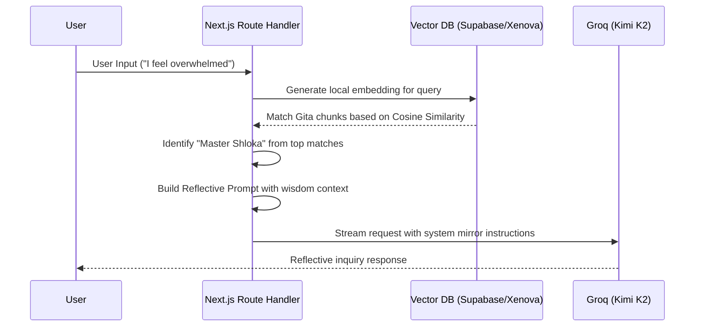

# Gita Mirror Architecture

This document describes the high-level architecture and design patterns used in **Gita Mirror**, a reflective AI guide built on the wisdom of the Bhagavad Gita.

## Architectural Principles

Gita Mirror is built with a focus on **Emotional Intelligence**, **Clean Separation of Concerns**, and **Modern RAG (Retrieval-Augmented Generation)** techniques.

1.  **Layered Responsibility**: The codebase is divided into Layers:
    *   **Core**: Shared types, constants, and utilities.
    *   **Services**: External integrations and business logic (AI, Database).
    *   **Features**: Domain-specific UI and state management (e.g., Chat).
    *   **Components**: Generic, reusable UI building blocks.
2.  **Reflective AI Implementation**: Unlike standard AI bots that provide direct answers, the architecture is designed to prioritize *reflection* and *inquiry*.
3.  **Data Sovereignty**: Separation of raw "Data Engineering" tools from the production application code.

## The RAG Pipeline

The application implements a custom RAG (Retrieval-Augmented Generation) pipeline to ground the AI's responses in authentic Gita wisdom.



## Directory Structure

```bash
src/
├── app/             # Next.js App Router (Routing and Main Entry Points)
├── core/            # System-wide configuration, types, and constants
├── services/        # Infrastructure and external API service logic
├── features/        # Component folders organized by application domain
├── components/      # Project-wide primitive UI components
└── hooks/           # Reusable React hooks for side-effects and state
```

## Tech Stack

*   **Framework**: Next.js 15 (React 19)
*   **AI Orchestration**: LangChain.js
*   **Vector Engine**: Supabase (pgvector)
*   **Embeddings**: Xenova/all-MiniLM-L6-v2 (Local Browser/Node inference)
*   **LLM Provider**: Groq (Kimi K2 Instruct)
*   **Styling**: Tailwind CSS 4 with Framer Motion for premium animations
